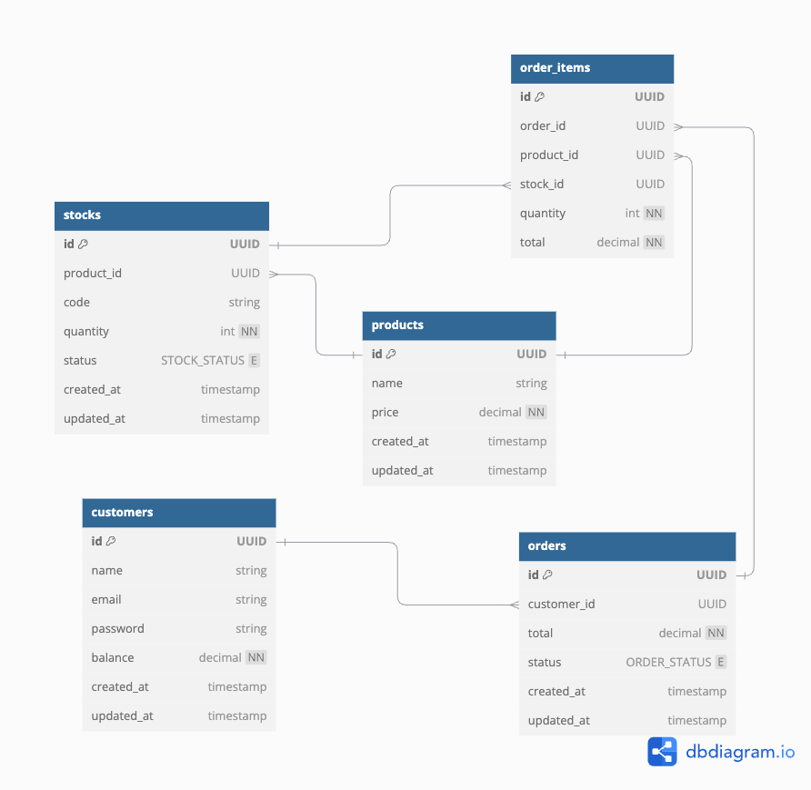

<p align="center">
  <a href="http://nestjs.com/" target="blank"></a>
</p>

[circleci-image]: https://img.shields.io/circleci/build/github/nestjs/nest/master?token=abc123def456
[circleci-url]: https://circleci.com/gh/nestjs/nest

  <p align="center">A progressive <a href="http://nodejs.org" target="_blank">Node.js</a> framework for building efficient and scalable server-side applications.</p>
    <p align="center">
<a href="https://www.npmjs.com/~nestjscore" target="_blank"></a>
<a href="https://www.npmjs.com/~nestjscore" target="_blank"></a>
<a href="https://www.npmjs.com/~nestjscore" target="_blank"></a>
<a href="https://circleci.com/gh/nestjs/nest" target="_blank"></a>
<a href="https://coveralls.io/github/nestjs/nest?branch=master" target="_blank"></a>
<a href="https://discord.gg/G7Qnnhy" target="_blank"></a>
<a href="https://opencollective.com/nest#backer" target="_blank"></a>
<a href="https://opencollective.com/nest#sponsor" target="_blank"></a>
  <a href="https://paypal.me/kamilmysliwiec" target="_blank"></a>
    <a href="https://opencollective.com/nest#sponsor"  target="_blank"></a>
  <a href="https://twitter.com/nestframework" target="_blank"></a>
</p>
  <!--[](https://opencollective.com/nest#backer)
  [](https://opencollective.com/nest#sponsor)-->

## Description

[Nest](https://github.com/nestjs/nest) framework TypeScript starter repository.

## Installation

```bash

# install postgresql
$ docker compose up -d

# dependencies
$ npm install

# prisma migrate
$ npm run migrate:dev
```

## seed data

manually run the sql file in prisma/migrations/20241206142005_init_schema_for_jenosize_e_commerce/seed.sql

## Running the app

```bash
# development
$ npm run start

# watch mode
$ npm run start:dev

# production mode
$ npm run start:prod
```

# ER



# high level design


# use case


# documentation usecase, High level architecture, ERD

https://drive.google.com/file/d/1xynGcRKgr8foWy6LlxWa08vbaDlZL8Ux/view?usp=sharing

## Assignment 1: Code Challenge

พัฒนาด้วย Nestjs(ts) structure จะเป็น controller service และใช้ prisma ORM โดย docker compose postgres

- {/v1/api/orders, POST}
- {/v1/api/orders, GET}
- {/v1/api/orders/:orderId, GET}
- {/v1/api/register, POST}
- {/v1/api/login, POST}
- {/v1/api/products, GET}

## Assignment 2: Debugging Task

มีการรับ product เป็น array

- {/v1/api/orders, POST}

## Assignment 3: System Design Question

- input email and password แล้ว hash password store in database
- login ใช้ท่า JWT และ verify ใน auth guard

## Assignment 4: Bonus (Optional)

ข้อเสนอ: การเพิ่มฟีเจอร์แนะนำสินค้าส่วนบุคคลในแพลตฟอร์มอีคอมเมิร์ซ

การเพิ่มฟีเจอร์แนะนำสินค้าส่วนบุคคลในแพลตฟอร์มอีคอมเมิร์ซสามารถช่วยเพิ่มการมีส่วนร่วมของผู้ใช้งาน ความพึงพอใจของลูกค้า และรายได้ โดยใช้ข้อมูลผู้ใช้งานร่วมกับการทำ Machine Learning เพื่อแนะนำสินค้าที่ตรงกับความสนใจ ประวัติการเข้าชม และพฤติกรรมการซื้อของลูกค้า การนำเสนอสินค้าที่เหมาะสมกับแต่ละบุคคลจะช่วยสร้างประสบการณ์การช้อปปิ้งที่ดีขึ้นและมีความเป็นส่วนตัวมากยิ่งขึ้น

## License

```
Nest is [MIT licensed](LICENSE).
```
